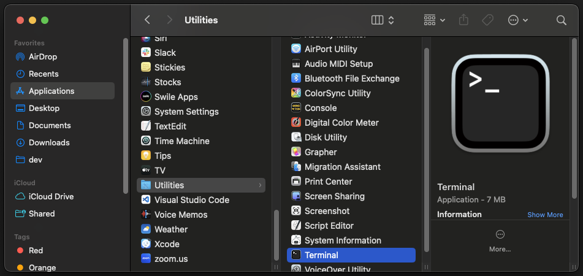
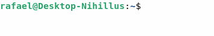

import OSTabs from "@site/src/components/ostabs.tsx";

# Usando computadores como programadores

Depois de toda essa conversa técnica, que tal começarmos algo mais mão-na-massa?

Vamos aprender aqui sobre como usar computadores como um programador. Mas o que tem de tão diferente?

Bom, como programadores nossa função é controlar a máquina para fazer com que ela faça exatamente o que queremos. Para isso, é bem útil termos formas mais diretas de nos comunicar e interagir com a máquina.

## 1. Nossas ferramentas

No geral, vamos utilizar bastante 1 ferramenta: a [**linha de comando**](https://pt.wikipedia.org/wiki/Interface_de_linha_de_comandos "Página da Wikipedia sobre Interfaces de Linha de Comando").

:::warning[ATENÇÃO!]
Muitas coisas nas outras partes da mentoria serão feita via linha de comando, e vão assumir que você sabe utilizar mesmo que de forma bem básica a linha de comando.

**Esta página ensina você o básico para se executar comandos.** Isso é importante para, num capítulo futuro, você não ficar perdido(a) quando ler algo como "E por fim, basta executar `npm run start`" :wink:
:::

### 1.1. Linha de comando

A principal, mais importante e mais poderosa ferramenta a nossa disposição é o que chamamos de [Linha de Comando](https://pt.wikipedia.org/wiki/Interface_de_linha_de_comandos "Página da Wikipedia sobre Interfaces de Linha de Comando"), ou Interface de Linha de Comando - do inglês **CLI: Command Line Interface**.

Essa é a famosa "tela preta" do Microsoft Windows:


A linha de comando - também chamada de Prompt de Comando no Windows - é a forma mais direta que temos de conversar com o Sistema Operacional e o computador em si. Com essa ferramenta enviamos comandos diretamente ao Sistema Operacional, muitas vezes da mesma forma como os programas fazem.

:::info[IMPORTANTE: Raramente vamos falar de "linha de comando"!]
Apesar de ser o nome da ferramenta, na maior parte do tempo ela é chamada de **Terminal, CLI ou Shell**.

- [**Terminal**](https://pt.wikipedia.org/wiki/Terminal_%28inform%C3%A1tica%29 "Página da Wikipedia sobre Terminal (computação)") é o nome do programa que o Sistema Operacional dá para que tenhamos acesso à Linha de Comando e, por isso, normalmente chamamos a "linha de comando" simplesmente de Terminal. A muuuuuuito tempo atrás, no tempo que computadores tomavam um andar inteiro de um prédio, "Terminal" era o nome do conjunto de Monitor + Teclado onde você podia ligá-lo a um desses computadores e dar comandos diretamente a ele. Semelhante a um controle de vídeo-game: qualquer controle de, por exemplo, Playstation 5 funciona em qualquer outro Playstation 5.
- **CLI** é a sigla do termo em inglês **C**ommand **L**ine **I**nterface - em português: Interface de Linha de Comando. É útil saber disso para buscar informações e ajuda: tente procurar "quantidade de espaço livre **_cli_**" (sem aspas) no Google (ou clique [aqui](https://www.google.com/search?q=quantidade+de+espaço+livre+cli)) e veja :smile:
- [**Shell**](https://pt.wikipedia.org/wiki/Shell_%28computa%C3%A7%C3%A3o%29), assim como Terminal, vem do nome de um programa que nos dá acesso à linha de comando. No Linux e Mac, há programas como [**BASH**](https://pt.wikipedia.org/wiki/Bash) (**B**ourne **A**gain **Sh**ell), [**ZSH**](https://pt.wikipedia.org/wiki/Z_shell) (simplesmente "**Z**-**Sh**ell" mesmo) e outros. O importante é que eles são Shells _(em português: concha)_: apenas uma casca entre você e a máquina.
:::

Agora que sabemos que existe e mais-ou-menos o que é a linha de comando, vamos aprender como usá-la a seguir. Colocamos instruções nos 3 Sistemas Operacionais mais comuns em computadores e alternativas para Android e iOS.

Porém, antes de continuar, é extremamente importante frisar:

:::danger[Nunca execute nada que você não conhece!]
Nunca execute nada que você não conhece ou não confia em um Terminal!

Lembre-se que o Terminal é uma porta direta para se conversar com o Sistema Operacional e o Computador. É algo útil e poderoso, e por essa razão devemos ter bastante cuidado com isso.

Dica: você pode procurar por "(primeira-palavra-do-comando) cli" no Google para entender melhor o que essa ferramenta faz. Por exemplo, na imagem acima foi usado o comando `ping google.com` - tente procurar por "ping cli" para entender o que ele faz.
:::

### 1.2. Acessando o Terminal

A seguir temos instruções de como acessar o Terminal nos Sistemas Operacionais mais usados (Windows, Linux e Mac) e alternativas para Android e iOS.

<OSTabs>
  <windows>
    :::tip[Dica]
    Recomendo ***fortemente*** a instalação do programa [Windows Terminal](https://aka.ms/terminal "Link oficial da Microsoft para baixar o Windows Terminal"). Ele é beeeeeem melhor que o Terminal padrão do Windows e se tornou o verdadeiro padrão nas versões mais atualizadas do Windows 11.
    :::
    Pressione a tecla "Windows"+X para exibir um menu para usuários avançados e clique na opção **Terminal**:

    

    Alternativamente, você pode abrir o Menu Iniciar (tecla Windows) e digitar `cmd` para encontrar o Prompt de Comando:

    

  </windows>
  <linux>
    Honestamente, a grande maioria dos usuários do Linux sabem o que é um Terminal, ou pelo menos onde acessar ele, pois várias atividades e configurações só podem ser feitas através do Terminal.

    Quase todas as "versões" diferentes (chamadas "distro") que tem interface visual têm um programa chamado **Terminal** (ou variações como `Konsole` ou `XTerm`) para dar acesso a ele. Se sua distro não tem interface visual... parabéns! Você já está no Terminal :smile:

  </linux>
  <mac>
    O Mac conta com um programa de Terminal, convenientemente chamado **Terminal** :smile: - a forma mais conveniente de abri-lo é usar o atalho Command+Espaço e digitar `Terminal`.

    Caso queira um programa com mais configurações e opções, recomendo instalar o [iTerm2](https://iterm2.com/).

    Para abrir o Terminal padrão que vem com o Sistema Operacional, você o encontra em Finder > Aplicativos > Utilidades:

    
  </mac>
  <android>
    O Android, apesar de ser Linux por trás dos panos, não trás por padrão um Terminal. Porém existem vários apps que podem dar essa funcionalidade.

    Dentre esses apps, recomendamos o [**Termux**](https://play.google.com/store/apps/details?id=com.termux&hl=pt-BR).

    

    *Imagem retirada da Google Play Store (Loja de Aplicativos)*

  </android>
  <ios>
    O iOS, apesar der ser semelhante ao Linux por trás dos panos, não trás por padrão um Terminal. Porém existem vários apps que podem dar essa funcionalidade.

    Dentre esses apps, recomendamos o [**a-Shell**](https://apps.apple.com/us/app/a-shell/id1473805438).

    

    *Imagem retirada da Apple Store (Loja de Aplicativos)*

  </ios>
</OSTabs>

---

### 1.3. Pastas/Diretórios e Arquivos

Antes de partirmos para aprender os componentes que compõem uma linha de comando, vamos rever os conceitos de **Pastas/Diretórios** e **Arquivos**.

Esses conceitos vêm da forma como escritórios costumavam organizar seus documentos: uma série de papéis (arquivos) ficam guardados em uma _pasta organizadora_ ou gaveta.

Essas ideias se mantém ainda hoje. **Arquivos** são onde nossas informações são guardadas: imagens, documentos, programas, etc.

Todo Arquivo obrigatoriamente TEM QUE estar dentro de uma pasta/diretório. Opcionalmente, cada pasta/diretório pode estar dentro de outra pasta/diretório:

A seguir, podemos ver uma **_navegação_** entre pastas/diretórios no Windows Explorer:


Nesta animação navegamos de `C:\`, que é o diretório-base do disco `C:`, e entramos no diretório `tools`, em seguida no diretório `vim` e por fim depois no diretório `vim90`.

**Tenha isso em mente, pois é bastante importante :wink: - E lembre-se que os termos "pasta" e "diretório" são a mesma coisa!**

:::info[Unidades de Disco]
O Windows conta com uma forma bem diferente de funcionar em comparação aos outros Sistemas Operacionais.

Primeiramente, no Windows existe o conceito de [**Unidade de Disco**](https://pt.wikipedia.org/wiki/Unidade_de_disco_r%C3%ADgido), que nada mais é que um Disco Rígido que é tratado separado dos outros.

Eles são referenciados a partir de letras que começam em `C` e sempre são acompanhados de um `:` em seguida da letra:


Nesta imagem vemos 3 unidades: `C:`, `D:` e `E:`. Todos os caminhos de pastas/diretórios no Windows vão começar com a letra do disco. Por exemplo: na animação acima navegamos para `C:\tools\vim\vim90`.
:::

### 1.4. Elementos que compõem uma linha de comando

Vamos ver agora os elementos que compõem uma linha de comando.

Todas as linhas de comando vão ter pelo menos 2 elementos principais:

- **"Onde" você está:** Pense em quantas coisas você faz em um computador envolvem arquivos. Como no Terminal vamos mandar comandos diretamente ao computador, não temos a facilidade de ter uma informação mais visual de que arquivos queremos ler ou salvar. Por esta razão, a linha de comando sempre se vincula a alguma pasta do seu computador. O "onde" é justamente isso: **dentro de qual pasta estamos no momento?**
- **A partir de que ponto você pode escrever:** Como tudo é texto, precisamos saber onde que começa o nosso texto e o texto do próprio terminal :smile: - Geralmente é um dos seguintes caracteres: `>`, `$` ou `#`

:::tip[Importante]
O "onde" estamos é muito importante pois todo comando que é executado, é **executado relativo a onde estamos**!

Esse "onde" é chamado de **Diretório de Trabalho**, ou em inglês: **Working Directory**.

É como o computador sabe quando pedimos para ele ler um arquivo **_onde_** ele pode encontrar o tal arquivo :wink:
:::

:::warning[Porque os exemplos estão iguais?]
Hoje em dia, as linhas de comando modernas se dividem apenas em "Windows" e "o Resto".

**O único Sistema Operacional que não tem uma linha de comando que funciona igual a do Linux é o Microsoft Windows.**

Por esta razão, boa parte dos exemplos do Linux, Mac, Android e iOS poderão ser iguais. Não tem diferenças entre eles :smile:
:::

A seguir temos explicações e descrições das linhas de comando mais comuns: estilo Windows e estilo Linux (se aplica a todos que não são o Windows).

<OSTabs>
  <windows>
    Os dois programas de Terminal do Windows, o `cmd` (Prompt de Comandos) e o [PowerShell](https://learn.microsoft.com/pt-br/powershell/scripting/install/installing-powershell-on-windows?view=powershell-7.4#installing-the-msi-package), têm a mesma estrutura de linha:

    

    Como dizia Jack, O Estripador: Vamos por partes. Nossa linha é `PS C:\tools>`

    1. O prefixo `PS` indica que estamos utilizando o PowerShell ao invés do `cmd`. No `cmd` não há prefixo algum.
    2. Em seguida vem onde estamos: `C:\tools` - Estamos dentro da pasta `tools`, a qual está dentro da raíz do disco `C:`.
    3. Por fim, vem o indicador de onde começa o nosso texto: `>` (um sinal de "maior que")

    Uma facilidade trazida pelo PowerShell é que ele destaca qual comando será executado ao se pressionar Enter:

    

    Ao pressionar Enter, o comando executado será o comando `ping`, e o resto da linha são os parâmetros do comando.

  </windows>
  <linux>
    No Linux ***e variantes*** (Mac, Android e iOS), o Terminal é bem mais avançado que no Windows.

    

    Como dizia Jack, O Estripador: Vamos por partes. Nossa linha é `rafael@Desktop-Nihillus:~$`

    Nessa linha de comando temos 2 partes: uma antes do `:` e outra depois.

    1. Normalmente os Terminais do Linux são bem integrados para acessar, também, **computadores remotos**. A primeira parte da linha de comando diz qual nosso usuário no sistema e qual sistema estamos: `rafael@Desktop-Nihillus` - Sou o usuário `rafael` e estou no computador `Desktop-Nihillus` (meu computador). O símbolo `@` significa "está em".
    2. Logo em seguida temos `:~`. Esse `:` é o divisor entre `<quem-é-você>` e `<onde-você-está>`. O `~` (til) é uma pasta especial nestes sistemas. Esse `~` significa sua pasta pessoal. É equivalente ao diretório `/home/<seu-usuário>`.\
    Se executarmos o comando `pwd` (do inglês **P**rint **W**orking **D**irectory, em português: Imprimir Diretório de Trabalho), comando para mostrar o diretório onde estamos, o diretório impresso é `/home/rafael`:\
    
    3. Por fim, temos o caractere que mostra que a partir daquele ponto é nosso texto: `$`. Vale salientar que no Linux e semelhantes, são usados 2 caracteres diferentes: `$` (cifrão) e `#` (cerquilha). O cifrão é usado quando o usuário atual NÃO tem permissões administrativas. Já a cerquilha é usada quando o usuário tem permissões administrativas.

  </linux>
</OSTabs>

### 1.5. Navegando no Terminal

Os primeiros comandos que vamos aprender são os comandos utilizados para navegarmos no Terminal. Quando falamos em navegação no Terminal queremos dizer mudar qual pasta estamos atualmente:

<OSTabs>
  <windows>
    
  </windows>
  <linux>
    
  </linux>
</OSTabs>

Como podemos ver, o primeiro comando que vamos aprender é o comando `cd`, do inglês **C**hange **D**irectory - em português: **Mudar Diretório**.

O comando `cd` recebe apenas 1 parâmetro que o nome da pasta onde queremos navegar. Se ela existir, navegamos até ela. Se não existir, ele nos informa que a pasta não existe.

Existem 2 pastas especiais chamadas `.` (ponto) e `..` ("ponto-ponto").

A pasta chamada `.` representa a pasta que estamos nesse momento. Isso é útil se quisermos deixar claro que onde quer que estejamos navegando será _relativo_ a onde estamos no momento. Esse tipo de navegação é chamada **Relativa** e é a forma padrão de navegar: quando você diz `cd proximo-diretorio` está subentendido que a pasta `proximo-diretorio` existe dentro da pasta que você está atualmente.

Já a pasta chamada `..` representa a pasta "acima" **da pasta que estamos atualmente**. Isso nos ajuda a "voltar" pastas que navegamos:

<OSTabs>
  <windows>
    
  </windows>
  <linux>
    
  </linux>
</OSTabs>

Note que o `..` é sempre **_relativo_** a pasta que estamos no momento. Observe o seguinte exemplo:

<OSTabs>
  <windows>
    
  </windows>
  <linux>
    
  </linux>
</OSTabs>

:::info[O contrário de 'Relativo' é...]
A navegação também pode ocorrer de forma "não relativa", ou seja, sem um ponto de partida. Essa navegação é chamada de **Absoluta**.

No exemplo acima, o primeiro comando faz uma navegação absoluta. Ela instrui o Terminal a ir exatamente a pasta informada.

A pasta informada não é relativa a nada, sabemos **_exatamente_** onde queremos ir.

Mas como o Terminal sabe disso? Se sua pasta começar com `/` (barra), ela será interpretada como absoluta. No caso do Windows, uma pasta que começa com uma Unidade de Disco (como `D:\software`) também é considerada como absoluta.
:::

---

O segundo comando para auxiliar a navegação se chama `ls` (ou **apenas no caso do Prompt de Comando** do Windows: `dir`).

O comando `ls` vem do inglês **L**i**s**t, em portugês: **L**i**s**tar.

Esse comando simplesmente mostra na tela uma lista das pastas e arquivos que existem no diretório onde estamos atualmente:

<OSTabs>
  <windows>
    
  </windows>
  <linux>
    
  </linux>
</OSTabs>

O comando `ls` pode ser executado sem nenhum parâmetro. Neste caso ele assume que você quer ver os arquivos do diretório onde você se encontra atualmente. Se quiser ver o conteúdo de outro diretório, basta dizer ao `ls` qual diretório você quer ver:

<OSTabs>
  <windows>
    
  </windows>
  <linux>
    
  </linux>
</OSTabs>

### 1.6. Nossos primeiros comandos

Como o nome deixa a entender, na interface de linha de _comando_ vamos executar **comandos**.

Para dar comandos, basta digitar o nome do comando e pressionar enter. No vídeo abaixo vemos como executar um comando `ping`:


A forma de escrever e executar comandos (apertando **Enter**) é igual em todos os Terminais.

Toda linha é composta de:

- **O comando que será executado:** Sempre a primeira palavra da linha é o comando que será executado. Vale salientar que nenhum comando tem "espaço" no nome. Muitos usam `hifens-como-espacos` ou `sublinhados_como_espacos`;
- **Seus parâmetros:** Tudo que vem na linha após o comando é enviado para o comando em si e compõem o que chamamos de parâmetros. São informações que o comando utiliza para funcionar ou mudar sua forma de funcionamento.

No exemplo acima, temos: `ping google.com` como nossa linha. A primeira palavra é o comando: `ping`. O comando `ping` verifica se nosso computador consegue conversar com outro computador pela Internet. O parâmetro que o comando `ping` espera é **_qual_** computador vamos tentar nos comunicar.

Muitos dos parâmetros que os comandos esperam alteram como eles funcionam. Esses parâmetros normalmente começam com 1 ou 2 `-` (hífen) ou **apenas no caso de comandos antigos do Windows**, uma `/` (barra).

Praticamente todos os comandos contam com uma sessão de ajuda. Você pode acessar essa ajuda com o parâmetro `-?`, `-h`, `--help` _(do inglês help: ajuda, em português)_ ou no caso de comandos mais antigos do Windows, com `/?`:

```text
PS C:\tools> ping /?

Uso: ping [-t] [-a] [-n count] [-l size] [-f] [-i TTL] [-v TOS]
          [-r count] [-s count] [[-j host-list] | [-k host-list]]
          [-w timeout] [-R] [-S srcaddr] [-c compartment] [-p]
          [-4] [-6] target_name

Opções:
    -t             Executa ping no host especificado até ser parado.
                   Para ver as estatísticas e continuar, pressione
                   Control-Break;
                   Para parar, pressione Control-C.
    -a             Resolve os endereços para nomes de host.
    -n count       Número de solicitações de eco a serem enviadas.
    -l size        Envia o tamanho de buffer.
    -f             Define o sinalizador Não Fragmentar no pacote
                   (somente IPv4).
    -i TTL         Vida útil.
    -v TOS         Tipo de Serviço (somente IPv4. Essa configuração
                   foi preterida e não afeta o tipo de campo de serviço
                   no Cabeçalho IP).
    -r count       Registra a rota de saltos de contagem (somente IPv4).
    -s count       Carimbo de data/hora para saltos de contagem (somente IPv4).
    -j host-list   Rota de origem flexível em host-list (somente IPv4).
    -k host-list   Rota de origem rígida em host-list (somente IPv4).
    -w timeout     Tempo limite em milissegundos de espera por cada resposta.
    -R             Usa o cabeçalho de roteamento para testar também a rota
                   inversa (somente IPv6). Conforme RFC 5095, o uso desse
                   cabeçalho de roteamento foi preterido. Alguns sistemas podem
                   remover solicitações de eco se esse cabeçalho for usado.
    -S srcaddr     Endereço de origem a ser usado.
    -c compartment Identificador de compartimento de roteamento.
    -p             Executa ping em um endereço de provedor de Virtualização
                   de Rede Hyper-V.
    -4             Força o uso de IPv4.
    -6             Força o uso de IPv6.
```

Cada comando tem sua própria lista de parâmetros, específicas do comando.

:::tip[Dica]
Antes de partirmos, uma dica importante e interessante: muitos comandos (nem todos) têm parâmetros opcionais e obrigatórios. Na ajuda do comando, os opcionais ficam **[entre colchetes]**. Já os obrigatórios ficam **&lt;entre maior-e-menor-que&gt; ou não ficam rodeados de nada**.

No exemplo acima, vemos que **todos os parâmetros são opcionais exceto `target_name`**, que não está entre colchetes.

Outra dica bacana de saber: muitos comandos mais modernos contam com o que são chamados de parâmetros resumidos e parâmetros extensos. Vimos um breve exemplo disso com `-h` e `--help`: eles são a mesma coisa, mas um é resumido (apenas 1 hífen e apenas 1 letra) e o outro é a versão extensa (2 hífens e uma palavra). E **alguns desses parâmetros recebem valores!** Por exemplo:


:::

# Resumo

Nesta loooonga página, aprendemos a como dar comandos diretamente ao computador através de um Terminal:

- **Pastas são a mesma coisa que Diretórios**: Precisamos saber navegar por elas para usar o Terminal adequadamente;
- **Terminais:** Os sistemas operacionais contam com aplicações chamadas de Terminal para que possamos dar comandos diretamente ao Sistema Operacional e/ou a máquina;
- **No terminal, escrevemos comandos e executamos eles apertando `Enter`:** A primeira palavra é qual comando será executado e as seguintes são os parâmetros;
- **Muitos comandos contam com uma ajuda de como usá-los**: Essa ajuda pode ser acessada com um dos seguintes parâmetros: `-?`, `-h`, `--help` ou apenas no caso do Windows `/?`
