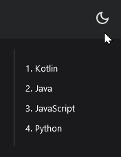

# Linguagens de programação

Agora, com toda essa base teórica que aprendemos até aqui, vamos começar a falar sobre Linguagens de Programação.

Imagine uma receita de bolo. Essa mesma receita pode ser escrita em Português, Inglês, Espanhol, Alemão, Francês, Hindi, Chinês, ...

Linguagens de Programação são como as línguas citadas acima: são formas diferentes de se dizer a mesma coisa!

Neste curso, vamos utilizar ~Português, Inglês, Espanhol e Alemão~ JavaScript, Python, Kotlin e Java :wink:

Vamos utilizar essas 4 linguagens pois elas trazem uma boa mescla de:

- **Fáceis de Aprender:** Essas linguagens são fáceis de aprender e bastante acessíveis. Vamos usar 4 pois cada uma tem um estilo diferente e características diferentes. Talvez você tenha mais facilidade de entender Python ao invés de Kotlin.
  <small>
    Usando nossa analogia: tanto Português, Inglês, Espanhol como Alemão usam as
    mesmas letras do alfabeto para escrever suas palavras, mas cada uma tem suas
    próprias regras gramaticais, acentos, gírias, etc.
  </small>
- **Importantes para o Mercado:** Apesar de que para algumas pessoas, como essa que está escrevendo isso agora, programar é algo que elas fazem com prazer e paixão, todos nós temos contas para pagar. Essas 4 linguagens têm uma boa aceitação no mercado atual (2025) e sabendo pelo menos uma dessas já permite você a começar a concorrer por vagas :)
  <small>
    Usando nossa analogia: saber Português lhe permite encontrar trabalho no
    Brasil, Portugal, Moçambique e outros países lusófonos. Já saber Espanhol
    abre outras portas, em outros lugares. O mesmo se aplica a essas linguagens.
  </small>
- **Especialidades diferentes:** Cada uma dessas lingagens é mais utilizada em uma ou outra faceta da programação. Python, por exemplo, é bastante utilizada com análise de dados e inteligência artificial. Já o JavaScript é o que faz sites como esse funcionar. Muitos aplicativos para celular, em particular Android, são feitos usando Kotlin. Por fim, muitas aplicações corporativas como sistemas financeiros e bancários são feitas com Java.
  <small>
    Usando nossa analogia: Português e Espanhol são parecidas, mas diferentes:
    ambas são línguas *latinas*. O mesmo vale para Inglês e Alemão: ambas são
    línguas *germânicas*. Quem fala Português consegue entender um pouco do
    Espanhol. Quem fala Inglês também consegue entender um pouco do Alemão.
  </small>

Vamos a seguir falar um pouco sobre as 4 linguagens que vamos utilizar.

:::info[Antes de continuar...]
Assim como línguas humanas, linguagens de programação surgem e desaparecem o tempo todo. Porém, algumas linguagens "ficam para sempre": Antigamente havia o Latim, hoje uma "língua morta", mas que depois de muita transformação durante séculos acabou dando origem ao Português... e hoje temos os famosos "Português de Portugal" e "Português do Brasil".

Linguagens de Programação são semelhantes. Sempre estão aparecendo novas linguagens, mas algumas "ficam para sempre": [C](<https://pt.wikipedia.org/wiki/C_(linguagem_de_programa%C3%A7%C3%A3o)>), [C++](https://pt.wikipedia.org/wiki/C%2B%2B), [Fortran](https://pt.wikipedia.org/wiki/Fortran), [Ruby](<https://pt.wikipedia.org/wiki/Ruby_(linguagem_de_programa%C3%A7%C3%A3o)>), [Visual Basic](https://pt.wikipedia.org/wiki/Visual_Basic), [PHP](https://pt.wikipedia.org/wiki/PHP), [**Lua (uma liguagem brasileira!)**](<https://pt.wikipedia.org/wiki/Lua_(linguagem_de_programa%C3%A7%C3%A3o)>), ...

**Boa parte das linguagens mais utilizadas atualmente têm por volta de 30+ anos!** Para uma área que está sempre mudando, evoluindo, se atualizando e adaptando isso mostra o quanto essas linguagens são boas e sólidas para fazerem o que se propõem.

Se estiver curiosa(o), existem pesquisas da área como [essa](https://www.jetbrains.com/lp/devecosystem-2024/) e [essa](https://survey.stackoverflow.co/2024/) que perguntam programadores ao redor do mundo com quais linguagens, ferramentas, etc. eles estão trabalhando para que possamos compartilhar uns com os outros as coisas boas :wink:
:::

## 1. Kotlin

Dessas 4 linguagens que vamos conhecer, [**Kotlin**](https://kotlinlang.org/) é a caçula ([Wikipedia](https://pt.wikipedia.org/wiki/Kotlin)). Ela foi criada recentemente, em 2010, por uma empresa chamada JetBrains e foi adotada pelo Google como **a linguagem de programação oficial do Android**.

O nome Kotlin vem de uma ilha no mar Báltico chamada [Ilha de Kotlin](https://pt.wikipedia.org/wiki/Ilha_de_Kotlin).

Alguns dos diferenciais do Kotlin são:

- **Aprender com os erros dos outros:** Ela tenta construir e evoluir em cima das coisas que deram certo em outras linguagens de programação e que agradam os programadores;
- **Não reinventar a roda:** Kotlin é completamente compatível com Java! Uma das especialidades da JetBrains antes de criar o Kotlin era _(e ainda é)_ trabalhar com Java. Java é famosa por ter uma imensa quantidade de ferramentas excelentes para fazer quase tudo e temos todas essas ferramentas a disposição de um programa Kotlin e, principalmente, vice-versa: É possível fazer um programa/ferramenta em Kotlin e utilizar o mesmo no Java;
- **Não só Android e Java:** As últimas evoluções sendo feitas no Kotlin estão evoluindo a linguagem e as possibilidades para torná-la uma linguagem mais abrangente, podendo funcionar em iPhones, Computadores e até dispositivos menores como eletrodomésticos. Além de melhorias para tornar a criação de Inteligências Artificiais melhor e mais simples.

É a linguagem favorita deste que escreve esse texto :heart: <small>Se quiser, dê uma olhadinha [aqui](https://qrcodekotlin.com/) :wink:</small>

## 2. Java

[**Java**](https://www.oracle.com/java/) ([Wikipedia](<https://pt.wikipedia.org/wiki/Java_(linguagem_de_programa%C3%A7%C3%A3o)>)) é a linguagem do mundo corporativo. A "linguagem de paletó", como gosto de definir. É uma linguagem bastante precisa e versátil, e foi criada em 1995 em uma empresa chamada Sun Microsystems e mais recentemente adquirida pela Oracle.

O nome Java vem de uma ilha na Indonésia chamada [Ilha de Java](https://pt.wikipedia.org/wiki/Java), que é também o nome do café que os criadores gostavam de tomar todos os dias: o [Café Java](https://blog.mercadocoffee.com.br/glossario/o-que-e-java-coffee-cafe-java/).

Alguns dos diferenciais do Java são:

- **Excelentes ferramentas para se fazer aplicações corporativas:** Poucas linguagens têm um conjunto de ferramentas sequer semelhante ao Java para se criar aplicações corporativas <small><em>(pense em um programa que pega todas as transações financeiras que aconteceram em um mês em um Banco e faz um relatório completo no formato Microsoft Excel)</em></small>;
- **Estrutura rígida e bem definida:** Normalmente as coisas em Java "só têm 1 jeito de serem feitas" _(note as aspas)_. Código executável só existe dentro de certas estruturas, por exemplo. Em várias outras linguagens, você pode simplesmente escrever código e ele será executado;
- **Convenções:** As aspas acima se dão por isso. Muitas coisas na linguagem Java são feitas seguindo convenções. A mais famosa delas é a chamada convenção do "get e set", onde tudo que recupera valores se chama `getExemplo` e tudo que grava valores se chama `setExemplo`. Se você seguir as convenções, tudo funciona como mágica. Se não, você vai ter bem mais trabalho...;
- **Guiada pela Comunidade, de forma organizada:** A linguagem Java e outras tecnologias adjacentes são controladas e guiadas pela comunidade que usa o Java através de um órgão chamado [JCP](https://www.jcp.org/): Java Community Process, em português: Processo Comunitário Java. É uma longa história, mas mais positiva que negativa;
- **Uma das poucas linguagens que podemos dizer que "Se escreve uma vez, se executa em todo lugar":** Devido a uma série de partes do ecosistema Java, ela é uma linguagem bastante versátil onde você consegue _escrever_ código Java em qualquer sistema e _executar_ programas Java em qualquer outro sistema! Pouquíssimas coisas estão presas ao Sistema Operacional onde o código executa.

:::danger[Não cometa essa gafe...]
**Não confunda Java com JavaScript: _A única coisa que elas têm em comum são as 4 primeiras letras do nome._**

Programadores Java não gostam quando confundem uma com a outra. Programadores JavaScript também não.

Confundir uma com a outra é um péssimo sinal, demonstra claramente que você não faz ideia do que está falando.

Talvez em alguns [memes](https://programmerhumor.io/java-memes/you-know-java-so-you-must-be-a-fullstack-developer/) _(o meme diz "Pessoas do RH que pensam que JavaScript é uma variante do Java" / "Eu que estou procurando emprego")_, mas enfim.
:::

## 3. JavaScript

Em completo contraste ao Java, temos o [**JavaScript**](https://pt.wikipedia.org/wiki/JavaScript), também chamado de [**ECMAScript**](https://tc39.es/ecma262/) ([Wikipedia](https://pt.wikipedia.org/wiki/ECMAScript)): uma linguagem bastante permissiva, sem tantos padrões nem convenções, criada em 1995 em uma empresa chamada Netscape com a intenção de permitir que websites tivessem inteligência e dinamismo. Ainda hoje, praticamente todas as páginas Web que têm algum tipo de interação utilizam o JavaScript para isso.

Por exemplo, o ícone do sol/lua no topo desta página: se seu sistema operacional estiver configurado para o Modo Escuro, a página ficará escura e clicando no botão é possível se trocar entre os modos Claro e Escuro:

Alguns dos diferenciais do JavaScript são:

- **Funciona em todo lugar:** Por ser uma linguagem de programação que funciona nos navegadores, onde você tiver acesso a um navegador você pode executar JavaScript;
- **A queridinha do momento:** Nos últimos anos, JavaScript teve um crescimento e adoção muito grande e se tornou a linguagem da moda no momento (2025) - isso significa que existe uma grande quantidade de conteúdo atual sobre essa linguagem;
- **Muitas ferramentas prontas:** Pelo crescimento do JavaScript e sua importância em ajudar a criar sites, existem inúmeras excelentes ferramentas para se utilizar no JavaScript;
- **Um começo mais simples:** Devido a sua característica de ser executada em navegadores, tudo que você precisa para executar JavaScript é um navegador, como o que você está usando para ler essa página. Além disso, a linguagem é mais permissiva no que você pode ou não fazer.

## 4. Python

Por fim, [**Python**](https://www.python.org/) ([Wikipedia](https://pt.wikipedia.org/wiki/Python)). Esta é uma linguagem que começou sua vida no ambiente das universidades e foi criada para ajudar as pessoas a aprenderem a programar. Com o tempo, ela começou a ser adotada por programadores em diferentes áreas e foi evoluindo e amadurecendo com isso.

Um dos focos da linguagem Python é ser fácil de entender e dar produtividade ao programador: escrever menos, de forma clara e fazer bastante.

Alguns dos diferenciais do Python são:

- **Suporte nativo a vários Sistemas Operacionais:** Não tão quanto o Java, mas é possível escrever programas Python e executá-los sem muita dificuldade em sistemas diferentes;
- **Extensa lista de ferramentas:** Python é bem conhecida por suas bibliotecas excelentes para "tudo". Quer fazer um programa de edição de áudio? Python tem bibliotecas para isso. Inteligência Artifical? Boa parte das melhores bibliotecas para isso são em Python;
- **Versátil e em todo lugar:** Por ser fácil de integrar com outros programas, muitos programas (como o [Microsoft Excel](https://support.microsoft.com/pt-br/office/introdu%C3%A7%C3%A3o-ao-python-no-excel-a33fbcbe-065b-41d3-82cf-23d05397f53d)) têm suporte a rodar programas e tarefas de forma automática através de código Python;
- **Te força a escrever código mais legível:** Várias outras linguagens usam `{` e `}` como delimitadores de código, o qual **_deveria_** ter um indicador visual de que aquele código está dentro dessas chaves. Em Python não temos esses delimitadores, e o indicador TEM que existir.

## 5. Qual linguagem usar?

Infelizmente, uma discussão recorrente - e que na minha opinião é irrelevante e improdutiva - é a de "qual a melhor linguagem?" ou "qual linguagem eu devo aprender?"

As respostas sempre serão:

- **Qual a melhor linguagem?** A que resolve seu/o problema.
- **Qual linguagem eu devo aprender?** A que você tiver mais facilidade de entender, escrever e executar.

Pense nisso como os livros. Usando O Alquimista, de Paulo Coelho, como exemplo: Segundo a Wikipedia, este é o livro brasileiro mais traduzido do mundo, totalizando 88 idiomas. **As 88 línguas terão palavras diferentes, mas todas vão contar a mesma história.**

Ou a série de livros O Senhor dos Anéis: livros originalmente escritos em inglês, mas traduzidos em várias línguas. Todas as traduções vão contar a mesma história.

Escolhi ter o curso nestas 4 linguagens, pois podemos escrever os mesmos programas nas 4 linguagens - assim como praticamente qualquer outra linguagem.

Essas 4 foram escolhidas pois são as que tenho mais familiaridade e são relevantes para o mercado de trabalho.

  <small>
    ~Ou você quer mesmo escrever um livro em Mandarim? Ou Hindi? Ou Russo? Ou
    Coreano? Ou...~
  </small>

  <small>
    Ou você quer mesmo fazer um programa complexo com
    [Haskell](https://pt.wikipedia.org/wiki/Haskell_(linguagem_de_programa%C3%A7%C3%A3o))?
    Ou em [Lisp](https://pt.wikipedia.org/wiki/Lisp)? Ou talvez
    [Scala](https://pt.wikipedia.org/wiki/Scala_(linguagem_de_programa%C3%A7%C3%A3o))?
    Ou...
  </small>

  <small>
    É só brincadeira! Assim como os livros, vamos aprender não só as línguas mas
    também ideias que podemos transformar em histórias!
  </small>

# Resumo

Nesta página conhecemos sobre as 4 linguagens que vamos utilizar daqui em diante:

- **Kotlin:** Linguagem mais nova, com interoperabilidade com Java e bastante usada no Android (Sistema Operacional);
- **Java:** Linguagem mais "corporativa", rígida e versátil. Boa para sistemas comerciais, financeiros, etc.;
- **JavaScript:** Linguagem usada nos navegadores e pelos sites para se ter dinamismo nas páginas. A mais simples de se começar;
- **Python:** Linguagem versátil e "tem em todo lugar", com uma poderosíssima seleção de ferramentas para se fazer de tudo.
