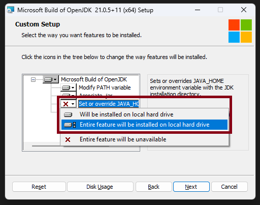

import OSTabs from "@site/src/components/ostabs.tsx";
import LangTabs from "@site/src/components/langtabs.tsx";

# Preparando para Programar

Finalmente, vamos nos preparar para programar: vamos instalar e configurar um conjunto de programas chamado SDK - Software Development Kit, em português: Kit para Desenvolvimento de Software. São programas que vamos usar para transformar nosso código em programas que o computador consegue executar!

:::info[Abas das Linguagens]
Daqui em diante, sempre que tivermos código ou instruções para se fazer alguma coisa em uma linguagem, teremos essas abas com as 4 linguagens.

Escolher uma Aba muda **_todas_** as abas para aquela linguagem :wink:
:::

## 1. Mas espera, e sem ser no Computador?

Antes de continuarmos para as instruções de instalação em computadores (ou seja: Windows, Linux e MacOS) **existem alternativas caso você não queira ou não possa instalar nada no seu computador**. Essas são opções que não são tão confortáveis quanto as disponíveis diretamente no computador, mas nada nos impede de usá-las.

Essas opções normalmente são chamadas de **Playgrounds**. Quer escrever um código e ver se ele funciona ou faz o que você quer? Só procurar um "java playground", por exemplo.

<LangTabs>
  <kotlin>
    O Kotlin tem um site oficial já pronto para você escrever código e executar ele: https://play.kotlinlang.org
  </kotlin>
  <java>
    Hoje em dia o Java tem um site oficial já pronto para você escrever código e executar ele: https://dev.java/playground/
  </java>
  <js>
    Como a casa do JavaScript é o navegador em si, existem inúmeras ferramentas para escrever e executar JavaScript.

    Experimente as seguintes opções e veja qual você acha melhor (lista feita em 2025):

    - **JS Playground:** https://www.jsplayground.dev/ - Destes, é o meu favorito: apenas seu código e o resultado da execução do código.
    - **RunJS:** https://runjs.app/play - Outra boa opção, simples e funciona
    - PlayCode: https://playcode.io/javascript
    - JS Fiddle: https://jsfiddle.net/
    - Mozilla (criadora do navegador Firefox): https://developer.mozilla.org/en-US/play

  </js>
  <python>
    Python conta com várias ferramentas para escrever código no próprio navegador.

    Uma delas é a Polylang: https://polylang.io/#/python

    Este site tem ferramentas para se escrever código que funcionam totalmente no seu navegador, nada de código indo para lá e para cá via Internet.

  </python>
</LangTabs>

## 2. Configurando seu Computador

<LangTabs>
  <kotlin>
    O Kotlin ainda continua relativamente dependente do Java para funcionar.
    Para instalar o que precisamos para o Kotlin funcionar, na verdade é quase o mesmo
    que o que precisaremos para o Java.

    Vamos instalar um conjunto de programas chamado **JDK - Java Development Kit**, em português: Kit para Desenvolvimento em Java.

    <h3>Instalação</h3>

    <OSTabs hidden>
      <windows>
        No Windows, a instalação do JDK do Java se dá como qualquer outro programa:

        1. Escolha uma das opções de download disponíveis nesta página: https://learn.microsoft.com/pt-br/java/openjdk/download \
           **Recomendamos a OpenJDK 11, 17 ou 21** - Para baixar o instalador da versão OpenJDK 21 diretamente, [clique aqui](https://aka.ms/download-jdk/microsoft-jdk-21-windows-x64.msi).
        2. Depois, basta instalar como qualquer programa: Abra o arquivo baixado e siga as instruções do instalador.
        3. **:warning: Importante :warning:**\
           Durante a instalação, você verá uma tela semelhante a tela abaixo. Clique no botão da opção que fala sobre `JAVA_HOME` e selecione uma das duas primeiras opções _(em destaque na imagem: a opção sobre JAVA_HOME, o botão e o menu de opções que aparece ao clicar no botão)_:\
           
        4. Execute o comando `java -version` para testar se instalou corretamente. Se a saída for semelhante a esta abaixo, pronto!\
           
      </windows>
    </OSTabs>

  </kotlin>
  <java>Java xpto</java>
  <js>JS xpto</js>
  <python>Python xpto</python>
</LangTabs>
