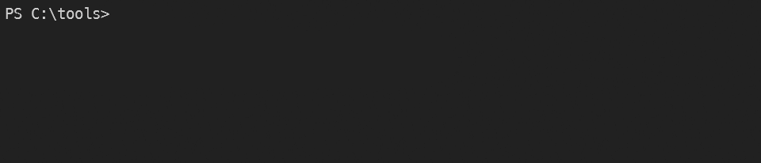
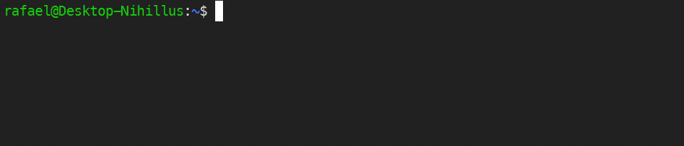
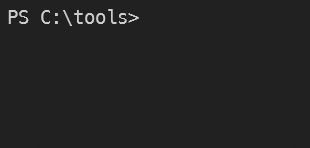
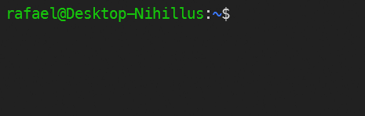
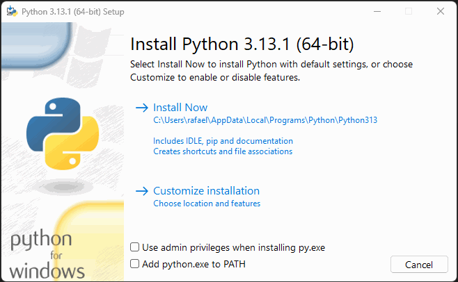

import Tabs from "@theme/Tabs";
import TabItem from "@theme/TabItem";
import OSTabs from "@site/src/components/ostabs.tsx";
import LangTabs from "@site/src/components/langtabs.tsx";

# Preparando para Programar

Finalmente, vamos nos preparar para programar: vamos instalar e configurar um conjunto de programas chamado SDK - Software Development Kit, em português: Kit para Desenvolvimento de Software. São programas que vamos usar para transformar nosso código em programas que o computador consegue executar!

:::info[Abas das Linguagens]
Daqui em diante, sempre que tivermos código ou instruções para se fazer alguma coisa em uma linguagem, teremos essas abas com as 4 linguagens.

Escolher uma Aba muda **_todas_** as abas para aquela linguagem :wink:
:::

:::tip[De graça?]
A comunidade de Programação e Desenvolvimento de Software, num geral, é uma comunidade bastante generosa.

**As melhores ferramentas são todas gratuitas.** E quase sempre sem pegadinhas.

Todas as ferramentas que serão sugeridas aqui são gratuitas e normalmente também são as melhores que o mercado oferece.

Existem algumas, como o IntelliJ IDEA por exemplo, que têm uma versão paga que inclui várias outras ferramentas para auxiliar no desenvolvimento. Elas aumentam sua produtividade, mas não são necessárias para se criar programas.

Pense nisso como um valor extra para se ter vidros automáticos em um carro: Ter isso é cômodo? Com certeza. Ter isso é necessário para dirigir/usar o carro? Não :sweat_smile:

---

:warning: **Fique atento!** As ferramentas com versões pagas normalmente têm uma "Edição da Comunidade" ou "Versão Comunitária" que são suas versões gratuitas :wink:

---

Vamos falar mais sobre as razões das coisas serem assim no futuro. Não crescemos nos ombros de gigantes, mas sim nos ombros de inúmeras pessoas que trabalham árduamente para melhorar o mundo.
:::

## 1. Configurando seu Computador

A seguir estão instruções para termos o mínimo necessário para que possamos escrever e executar nossos programas em nosso próprio computador.

:::warning[Só computadores]
Infelizmente esse tipo de ferramentas e programas **NÃO** estão disponíveis para Celulares. Se você estiver em um, experimente usar as alternativas compartilhadas na próxima seção.
:::

<LangTabs>
  <kotlin>
    O Kotlin ainda continua bastante dependente do Java para funcionar.
    Instalar o que precisamos para o Kotlin funcionar, na verdade é o mesmo que o que precisaremos para o Java!

    Vamos instalar um conjunto de programas chamado **JDK - Java Development Kit**, em português: Kit para Desenvolvimento em Java.

    <h3>a) Instalação</h3>

    <OSTabs hidden>
      <windows>
        No Windows, a instalação de um JDK se dá como qualquer outro programa:

        1. Escolha uma das opções de download disponíveis nesta página: https://learn.microsoft.com/pt-br/java/openjdk/download \
           **Recomendamos a OpenJDK 11, 17 ou 21** - Para baixar o instalador da versão OpenJDK 21 diretamente, [clique aqui](https://aka.ms/download-jdk/microsoft-jdk-21-windows-x64.msi).
        2. Depois, basta instalar como qualquer programa: Abra o arquivo baixado e siga as instruções do instalador.
        3. **:warning: Importante :warning:**\
           Durante a instalação, você verá uma tela semelhante a tela abaixo. Clique no botão da opção que fala sobre `JAVA_HOME` e selecione uma das duas primeiras opções _(abaixo está uma animação mostrando como fazer isso)_:\
           
      </windows>
      <linux>
        No Linux, a instalação de um JDK é dependente da distribuição do Linux que você utiliza.

        Para facilitar, recomendamos o uso da ferramenta [**SDKMAN!**](https://sdkman.io/): este é um gerenciador de pacotes específicamente feito para se instalar, configurar e gerenciar JDKs e ferramentas adjacentes (como o Maven e Gradle).

        Para instalar o SKDMAN! execute o seguinte:

        ```text
        curl -s "https://get.sdkman.io" | bash
        ```

        Após a instalação, você pode utilizar o SDKMAN! através do comando `sdk`. Para instalar a JDK estável mais atual (atualmente: versão 21), basta executar:

        ```text
        sdk install java
        ```

        Após a instalação, o SDKMAN! perguntará se você deseja utilizar essa JDK instalada (no exemplo abaixo é a `21.0.5-tem`) como a padrão. Diga que Sim (digite `Y` e pressione enter):

        ```text
        Do you want java 21.0.5-tem to be set as default? (Y/n):
        ```

        Veja a seguir o processo de instalação _(idealmente sua instalação não terá esses erros que a minha teve, mas pode ignorá-los)_:

        
      </linux>
      <mac>
        No Mac, a instalação de um JDK é bem simples através do uso da ferramenta [**SDKMAN!**](https://sdkman.io/): este é um gerenciador de pacotes específicamente feito para se instalar, configurar e gerenciar JDKs e ferramentas adjacentes (como o Maven e Gradle).

        Para instalar o SKDMAN! execute o seguinte:

        ```text
        curl -s "https://get.sdkman.io" | bash
        ```

        Após a instalação, você pode utilizar o SDKMAN! através do comando `sdk`. Para instalar a JDK estável mais atual (atualmente: versão 21), basta executar:

        ```text
        sdk install java
        ```

        Após a instalação, o SDKMAN! perguntará se você deseja utilizar essa JDK instalada (no exemplo abaixo é a `21.0.5-tem`) como a padrão. Diga que Sim (digite `Y` e pressione enter):

        ```text
        Do you want java 21.0.5-tem to be set as default? (Y/n):
        ```

        Veja a seguir o processo de instalação _(idealmente sua instalação não terá esses erros que a minha teve, mas pode ignorá-los)_:

        
      </mac>
    </OSTabs>

    <h3>b) Verificando se tudo instalou corretamente</h3>

    Para testar se tudo foi instalado corretamente, execute os comandos `java -version` e `javac -version`. Se a saída for semelhante a esta abaixo, pronto!

    <OSTabs hidden>
      <windows></windows>
      <linux></linux>
      <mac></mac>
    </OSTabs>
  </kotlin>
  <java>
    Vamos instalar um conjunto de programas chamado **JDK - Java Development Kit**, em português: Kit para Desenvolvimento em Java.

    <h3>a) Instalação</h3>

    <OSTabs hidden>
      <windows>
        No Windows, a instalação de um JDK se dá como qualquer outro programa:

        1. Escolha uma das opções de download disponíveis nesta página: https://learn.microsoft.com/pt-br/java/openjdk/download \
           **Recomendamos a OpenJDK 11, 17 ou 21** - Para baixar o instalador da versão OpenJDK 21 diretamente, [clique aqui](https://aka.ms/download-jdk/microsoft-jdk-21-windows-x64.msi).
        2. Depois, basta instalar como qualquer programa: Abra o arquivo baixado e siga as instruções do instalador.
        3. **:warning: Importante :warning:**\
           Durante a instalação, você verá uma tela semelhante a tela abaixo. Clique no botão da opção que fala sobre `JAVA_HOME` e selecione uma das duas primeiras opções _(abaixo está uma animação mostrando como fazer isso)_:\
           
      </windows>
      <linux>
        No Linux, a instalação de um JDK é dependente da distribuição do Linux que você utiliza.

        Para facilitar, recomendamos o uso da ferramenta [**SDKMAN!**](https://sdkman.io/): este é um gerenciador de pacotes específicamente feito para se instalar, configurar e gerenciar JDKs e ferramentas adjacentes (como o Maven e Gradle).

        Para instalar o SKDMAN! execute o seguinte:

        ```text
        curl -s "https://get.sdkman.io" | bash
        ```

        Após a instalação, você pode utilizar o SDKMAN! através do comando `sdk`. Para instalar a JDK estável mais atual (atualmente: versão 21), basta executar:

        ```text
        sdk install java
        ```

        Após a instalação, o SDKMAN! perguntará se você deseja utilizar essa JDK instalada (no exemplo abaixo é a `21.0.5-tem`) como a padrão. Diga que Sim (digite `Y` e pressione enter):

        ```text
        Do you want java 21.0.5-tem to be set as default? (Y/n):
        ```

        Veja a seguir o processo de instalação _(idealmente sua instalação não terá esses erros que a minha teve, mas pode ignorá-los)_:

        
      </linux>
      <mac>
        No Mac, a instalação de um JDK é bem simples através do uso da ferramenta [**SDKMAN!**](https://sdkman.io/): este é um gerenciador de pacotes específicamente feito para se instalar, configurar e gerenciar JDKs e ferramentas adjacentes (como o Maven e Gradle).

        Para instalar o SKDMAN! execute o seguinte:

        ```text
        curl -s "https://get.sdkman.io" | bash
        ```

        Após a instalação, você pode utilizar o SDKMAN! através do comando `sdk`. Para instalar a JDK estável mais atual (atualmente: versão 21), basta executar:

        ```text
        sdk install java
        ```

        Após a instalação, o SDKMAN! perguntará se você deseja utilizar essa JDK instalada (no exemplo abaixo é a `21.0.5-tem`) como a padrão. Diga que Sim (digite `Y` e pressione enter):

        ```text
        Do you want java 21.0.5-tem to be set as default? (Y/n):
        ```

        Veja a seguir o processo de instalação _(idealmente sua instalação não terá esses erros que a minha teve, mas pode ignorá-los)_:

        
      </mac>
    </OSTabs>

    <h3>b) Verificando se tudo instalou corretamente</h3>

    Para testar se tudo foi instalado corretamente, execute os comandos `java -version` e `javac -version`. Se a saída for semelhante a esta abaixo, pronto!

    <OSTabs hidden>
      <windows></windows>
      <linux></linux>
      <mac></mac>
    </OSTabs>
  </java>
  <js>
    Para o JavaScript, não é necessário instalar nada **se você executar seu código no seu navegador**. Ainda assim, recomendamos instalar o [**Node.js**](https://nodejs.org) (pronunciado "nôde-jóta-ésse").

    O Node.js é uma ferramenta que nos permite executar JavaScript **sem um navegador**, de forma autônoma como qualquer outra linguagem de programação. Além disso, ele conta com uma extensa biblioteca de ferramentas que podemos utilizar: a [**NPM**](https://www.npmjs.com), sigla para **N**ode **P**ackage **M**anager ou em português: Gerenciador de Pacotes do Node.

    <h3>a) Instalação</h3>

    <OSTabs hidden>
      <windows>
        No Windows, a instalação do Node.js se dá como qualquer outro programa:

        1. Na [página de download](https://nodejs.org/pt/download/prebuilt-installer) do Node.js, escolha a aba **Instalador do Pré-Compilado** e clique no botão.
        2. Depois, basta instalar como qualquer programa: Abra o arquivo baixado e siga as instruções do instalador.
      </windows>
      <linux>
        No Linux, é recomendado que o Node.js seja instalado através de um gerenciador de pacotes.

        1. Na [página de download](https://nodejs.org/pt/download/package-manager) do Node.js, escolha a aba **Gestor de Pacote**
        2. Selecione na parte logo abaixo das abas qual gerenciador de pacotes você quer utilizar (recomendado: `nvm`)
        3. Basta seguir os comandos que estarão logo em seguida.
      </linux>
      <mac>
        No Mac, é recomendado que o Node.js seja instalado através de um gerenciador de pacotes.

        1. Na [página de download](https://nodejs.org/pt/download/package-manager) do Node.js, escolha a aba **Gestor de Pacote**
        2. Selecione na parte logo abaixo das abas qual gerenciador de pacotes você quer utilizar (recomendado: `nvm`)
        3. Basta seguir os comandos que estarão logo em seguida.
      </mac>
    </OSTabs>

    <h3>b) Verificando se tudo instalou corretamente</h3>

    Para testar se tudo foi instalado corretamente, execute os comandos `node -v` e `npm -v` (atenção: uma das opções de instalação é o n**V**m e este é o n**P**m :wink:). Se a saída for semelhante a esta abaixo, pronto!

    <OSTabs hidden>
      <windows></windows>
      <linux></linux>
      <mac></mac>
    </OSTabs>
  </js>
  <python>
    Tudo que precisamos para programar em Python é o que ironicamente se chama simplesmente de [**Python**](https://www.python.org/downloads/). Veremos a seguir como instalar ele.

    :::info[Python e suas versões]
    Python tem um "probleminha" com suas versões. Existem diferenças importantes entre o Python 2 e 3, por exemplo, e certas coisas funcionam em uma mas não na outra. Como estamos **aprendendo a programar**, essas diferenças não serão tão impactantes para nós.

    Entretanto, vale salientar: vamos considerar que você está usando a versão mais nova do Python no momento, que é a `3.13` (vulgo "Python 3").
    :::

    <h3>a) Instalação</h3>

    <OSTabs hidden>
      <windows>
        No Windows, a instalação do Python se dá como qualquer outro programa:

        1. Na [página de download](https://www.python.org/downloads/) do Python, clique no botão **Download Python** na área azul (parte superior do site, botão amarelo).
        2. Depois, basta instalar como qualquer programa: Abra o arquivo baixado e siga as instruções do instalador.\
           **:warning: Importante :warning: Durante a instalação, selecione a opção "Adicionar python.exe ao PATH". Isso fará com que o Python possa ser acessado pela linha de comando.**\
           Outra recomendação é instalar o Python para todos os usuários, como demonstrado abaixo:\
          
      </windows>
      <linux>
        No Linux, é recomendado que o Python seja instalado através de um gerenciador de pacotes. Tanto no Ubuntu (Debian) quanto no Fedora/CentOS (RHEL) o pacote do Python se chama `python3`:

        <Tabs groupId="distro" queryString>
          <TabItem value="debian" label="Ubuntu / Debian" default>
            ```
            sudo apt update && sudo apt install python3
            ```
          </TabItem>
          <TabItem value="rhel" label="Fedora / CentOS / RHEL">
            ```
            sudo dnf install python3
            ```
          </TabItem>
        </Tabs>
      </linux>
      <mac>
        No Mac, a instalação do Python se dá como qualquer outro programa:

        1. Na [página de download](https://www.python.org/downloads/) do Python, clique no botão **Download Python** na área azul (parte superior do site, botão amarelo).
        2. Depois, basta instalar como qualquer programa: Abra o arquivo baixado e siga as instruções do instalador.\
           **:warning: Importante :warning: Durante a instalação, selecione a opção "Adicionar python.exe ao PATH". Isso fará com que o Python possa ser acessado pela linha de comando.**\
           Outra recomendação é instalar o Python para todos os usuários, como demonstrado abaixo:\
          
      </mac>
    </OSTabs>

    <h3>b) Verificando se tudo instalou corretamente</h3>

    Para testar se tudo foi instalado corretamente, execute o comando `python3 --version`. Se a saída for semelhante a esta abaixo, pronto!

    <OSTabs hidden>
      <windows></windows>
      <linux></linux>
      <mac></mac>
    </OSTabs>
  </python>
</LangTabs>

## 2. Mas espera, e sem ser no Computador?

Antes de continuarmos para as instruções de instalação em computadores (ou seja: Windows, Linux e MacOS) **existem alternativas caso você não queira ou não possa instalar nada no seu computador**. Essas são opções que não são tão confortáveis quanto as disponíveis diretamente no computador, mas nada nos impede de usá-las.

Essas opções normalmente são chamadas de **Playgrounds**. Quer escrever um código e ver se ele funciona ou faz o que você quer? Só procurar um "java playground", por exemplo.

<LangTabs>
  <kotlin>
    O Kotlin tem um site oficial já pronto para você escrever código e executar ele: https://play.kotlinlang.org
  </kotlin>
  <java>
    Hoje em dia o Java tem um site oficial já pronto para você escrever código e executar ele: https://dev.java/playground/
  </java>
  <js>
    Como a casa do JavaScript é o navegador em si, existem inúmeras ferramentas para escrever e executar JavaScript.

    Experimente as seguintes opções e veja qual você acha melhor (lista feita em 2025):

    - **JS Playground:** https://www.jsplayground.dev/ - Destes, é o meu favorito: apenas seu código e o resultado da execução do código.
    - **RunJS:** https://runjs.app/play - Outra boa opção, simples e funciona
    - PlayCode: https://playcode.io/javascript
    - JS Fiddle: https://jsfiddle.net/
    - Mozilla (criadora do navegador Firefox): https://developer.mozilla.org/en-US/play
  </js>
  <python>
    Python conta com várias ferramentas para escrever código no próprio navegador.

    Uma delas é a Polylang: https://polylang.io/#/python

    Este site tem ferramentas para se escrever código que funcionam totalmente no seu navegador, nada de código indo para lá e para cá via Internet.

  </python>
</LangTabs>
